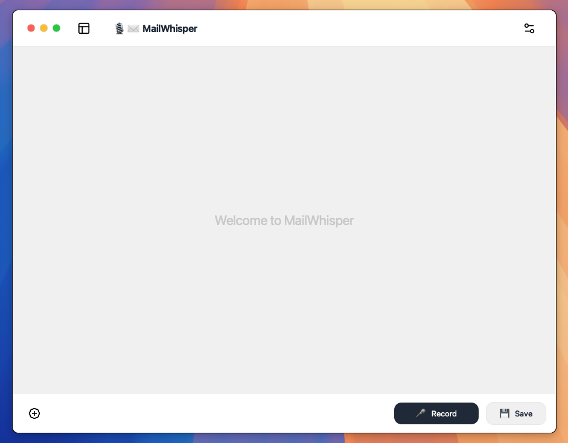

# 🎙️✉️ MailWhisper
## Local, Private, Collaborative Email Drafting Agent
MailWhisper is an Email Draft Agent that works with you to craft the perfect email. Start from a rough idea, a few notes, or a quick voice prompt, then iterate together until the draft fits your intent. Everything runs locally on your machine using a local LLM via Ollama and on-device speech-to-text, so it’s private, secure, and costs nothing to use.


- Voice-to-draft and iterative refinements
- Manual editing at any point
- Configurable tone (friendly, neutral, formal)
- Local LLM (via Ollama) and local Whisper transcription
- No cloud, no data sharing, no usage fees

> [!NOTE]
> #### MacOS Focus
> MailWhisper is designed and tested primarily on macOS. The UI is macOS‑styled and the packaged .app targets macOS. The Python/uv workflow may run on other platforms, but is not the primary target. However, only using the Backend should work on most other systems perfectly. You can just use the appropriate functions in the main.py file to switch to the CLI Mode.

## 🚀 Quick Overview



- Local STT: transcribe your voice to text with faster-whisper.
- Local LLM: use an Ollama model (tested with the qwen3 family).
- Structured edits: your instructions become targeted state updates (subject, tone, recipients, body).
- **Collaborative UI**: record more instructions or edit fields by hand at any time.
- Model choices in-app: pick the Ollama model and Whisper size from Settings.
- Private by design: no content leaves your machine; models are fully local.

## 🎥 Quick Live Demo

<video src="demo/demo-video.mp4" controls width="700"></video>

## 🛠️ Setup & Run
This repo uses [uv](https://github.com/astral-sh/uv) for Python environments & dependency management.

### Prerequisites
- [Ollama](https://ollama.com) installed and running
- [uv](https://github.com/astral-sh/uv)
- macOS microphone access (first run may trigger a **permission prompt**)

Install at least one capable LLM in Ollama ([qwen3](https://ollama.com/library/qwen3) recommended):
```bash
ollama pull qwen3:8b
# Optional higher-quality (slower):
# ollama pull qwen3:14b
```

Whisper models are downloaded automatically on first use by faster-whisper. You can pick the size (base/small/medium) in Settings.

### Option A — Run from source (dev)
```bash
uv sync
uv run main.py
```

- Spacebar toggles recording. Speak your idea; the draft updates.
- Click Settings to choose the Ollama model (e.g., qwen3:8b) and the Whisper model (base/small/medium).

### Option B — Use the bundled macOS app
If you downloaded the .app bundle, just open it on macOS.
- On first launch Gatekeeper may show a warning. Right-click the app → Open.
- Grant microphone access so recording works.

### Option C — Build your own .app
A PyInstaller spec is provided. From the repo root:
```bash
uv run pyinstaller --clean mailwhisper.spec
```

### Optional environment knobs
- `OLLAMA_MODEL` sets the default LLM (UI can override): e.g., `OLLAMA_MODEL=qwen3:8b`
- `WHISPER_LOCAL_MODEL` sets default STT model: `base`, `small`, or `medium` (UI can override)
- GPU (if available for faster-whisper):
  - `WHISPER_DEVICE=cuda`
  - `WHISPER_COMPUTE=float16`

> [!NOTE]
> #### Model quality vs. speed
> - LLM: The qwen3 family worked very well in testing. More parameters generally improve quality (e.g., qwen3:14b) but increase latency and memory usage. Choose based on your machine.
> - Whisper: “medium” transcribes more accurately than “small/base” but takes longer.

## 💡 Using MailWhisper


- Start recording (button or Spacebar), describe the email you need.
- The app drafts the email and fills:
  - To / Cc (only if you ask for it—never invented)
  - Subject
  - Tone (friendly, neutral, formal)
  - Body (full replacement each iteration to keep consistency)
- Refine naturally:
  - Speak more instructions to improve the draft (e.g., “Make it more formal and add a paragraph about deadlines.”).
  - Edit any field manually at any time (UI stays editable when idle).
- Copy helpers:
  - Each field has a copy action with quick feedback.
- Start over:
  - Use “New draft” to reset to a clean state.

## 🧠 How It Works (Technical)
MailWhisper’s backend uses LangGraph with a clear state-and-nodes design. The original prototype used a looped graph; for the UI we adapted it so the state can be edited by the user between node runs. Functionally it behaves like this:


- State (central): subject, to, cc, tone, body, transcript, intent
- Nodes:
  - transcribe: turns audio into text with faster-whisper (CLI flow).
  - intent: structured LLM step that produces an explicit Plan (Pydantic) for updates.
  - apply: merges the Plan into the state (careful merging for to/cc, tone, subject, body).
  - decide: CLI-only; the UI drives the loop itself.

In the desktop app:
- To enable certain UI features it was necessary to change the pipeline slightly.
- Audio is captured with sounddevice and transcribed via faster-whisper (in memory, no temp files).
- The UI calls `nodes.intent_node` and `nodes.apply_node` to turn your instructions into targeted edits.
- The Plan schema enforces structure:
  - Body is always returned in full (replace mode).
  - Recipients are cleaned and deduplicated; never invented.
  - The system prompt enforces placeholders for missing details (e.g., “[Recipient Name]”, “[Your Name]”) and prevents accidental verbatim insertion of your notes unless explicitly requested.

Dev note (graph image):
- To regenerate the graph diagram: `uv run -m tests.visualize_graph` (writes `img/graph.png`).

## 🧭 Tips for great results
- Be explicit about changes: “Add a new paragraph about timelines at the end just before 'Greetings, ...'”.
- Pick a tone up front: “Formal tone” leads to formal greeting/farewell.
- Provide recipients and subject when you have them; otherwise use placeholders.
- Iterate: it’s designed to refine, not one-shot.

## 🔧 Troubleshooting
- “Audio error” on record:
  - Ensure microphone permission is granted to the app or your terminal.
  - Check no other app has locked your input device.
  - Otherwise restart the application.
- “Model not found” / no LLM output:
  - Install and run Ollama; `ollama pull qwen3:8b` (or your choice).
- **Whisper slow on first run**:
  - The model may download or initialize; subsequent runs are faster.
- Use GPU for STT:
  - Set `WHISPER_DEVICE=cuda` and `WHISPER_COMPUTE=float16` if you have a compatible GPU.

## 🔮 Roadmap & ideas
- Better system prompt and style controls.
- Draft history and versioning.
- Refined draft state structure (e.g., signatures, identity profiles).
- Export options (.eml, Markdown), and “Send via …” integrations.
- Richer recipients editor and validation feedback.
- Multi-turn context controls and “compare drafts.”